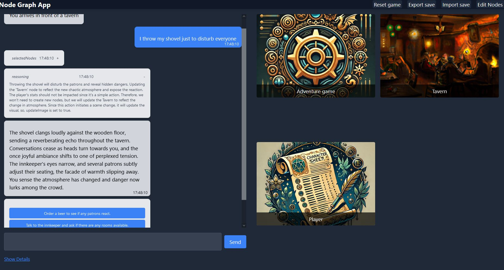

# Game Shaper AI

Interact with a Game-engine that keep building its rules and world as you play, adapted to your gameplay.

<p align="center">
    
</p>

[](https://discord.gg/spKp9zeuQV)

## I. Features
### Node-based system
We propose a node system that has few advantages over raw LLM gaming:
- Token-saving features to keep the API costs lowers, as large stories can easily scale in content. the AI only retrieves the content from the nodes it needs, while keeping a short context of all the available nodes
- UI to inspect any node in your game, with the possibility to store an image for each
- Adapt nodes as you play, or create game templates. Export your game stat at any moment to share the state of your gameplay and see how others diverge from it, or prepare a set of rules from scratch.

### Strong support for Local AIs
We have strong optimizations in place for local AIs using KoboldCPP for accessibility on smaller GPU, and thanks to a set of custom Grammar (GNBF), your AI, even the simpler one will very rarely produce unhandled output such as badly formated JSON.

We know local AI can be more prone to errors, and we made sure these will not break your adventure.




## II. How to use (OpenAI Example)
Node.js available here (Windows/linux/Mac)
`https://nodejs.org/en/download/package-manager`

Get the files, either:
- Download the repository from [this link](https://github.com/flotos/Game-Shaper-AI/archive/refs/heads/main.zip)
- Or clone the repository with
`git clone https://github.com/flotos/Game-Shaper-AI.git`

Get an OpenAI API key from this link `https://platform.openai.com/api-keys` (We recommend setting low usage cost so you can first see the pricing.)

Create a file named `.env` at the root of this folder
```
VITE_OAI_KEY=# Open ai api key
VITE_LLM_API=openai
VITE_IMG_API=openai
VITE_AOI_IMAGE_MODEL=dalle-e-3 # You can set dalle-e-2 instead for half the cost, lower quality
```

Run `start.bat` which will install dependencies and run a server.
On your browser open [http://localhost:3000](http://localhost:3000)

## III. Set up AI Tools (LLM, image generation)
### OpenAI
You can specify in the .env your API key and the model to use for image generation
[Sample .env](#sample-env)


### Stable Diffusion (Automatic1111)

Start your automatic1111 repository with the following argument:

```
--listen --api --api-log --cors-allow-origins "*" --ckpt yourmodel.safetensors --port 7860 --opt-sdp-attention
```

### KoboldCPP

Example launch argument for running Higgs-Llama-3-70B.Q4_K on 2 RTX 4090
```
./koboldcpp --port 5001 --usecublas --model ./model/Higgs-Llama-3-70B.Q4_K.gguf --flashattention --quantkv 0 --gpulayers 81 --contextsize 2048 --password nodegame
```

## IV. Notes
### Sample .env
```
VITE_OAI_KEY=# Open ai api key

VITE_LLM_API=koboldcpp #can be koboldcpp or openai
VITE_LLM_HOST=http://127.0.0.1:5001

VITE_IMG_API=automatic1111 #can be automatic1111 or openai (dalle-e)
VITE_IMG_HOST=http://127.0.0.1:7860
VITE_AOI_IMAGE_MODEL=dalle-e-3
```

### Quick notes

I have tested this project with both OpenAI and the following setup:

### Runpod "local" AI for 2.28€/h
- KoboldCPP on 2x 4090 GPU running the LLM [legraphista/Higgs-Llama-3-70B-IMat-GGUF](https://huggingface.co/legraphista/Higgs-Llama-3-70B-IMat-GGUF) at Q4_K quant.
- Stable diffusion XL on 1x4090 GPU

### OpenAI
About half the cost was images, the other GPT-4o. Each image is 0.02$ on dalle-e-2 and 0.04$ for dalle-e-3 [pricing](https://openai.com/api/pricing/)